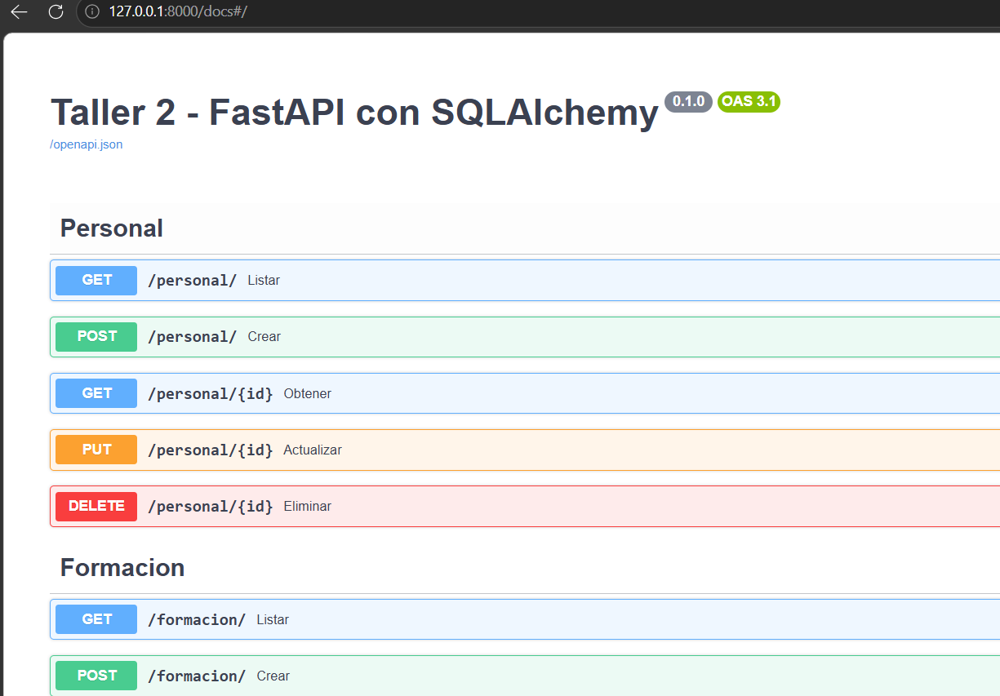
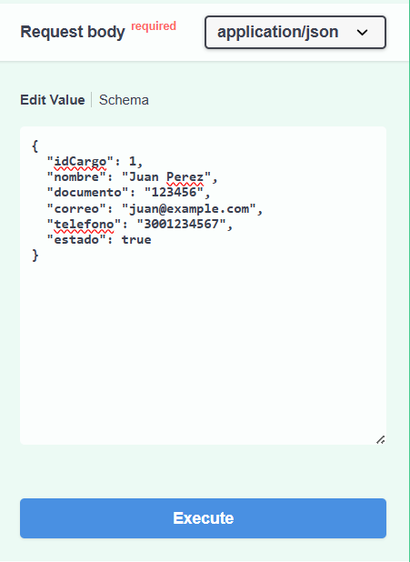
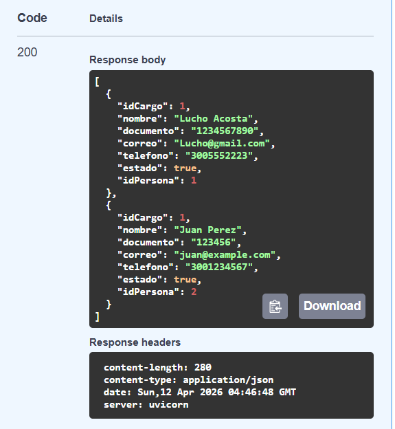
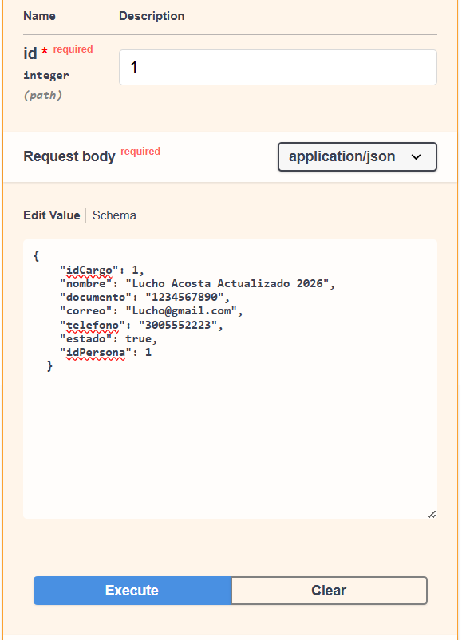
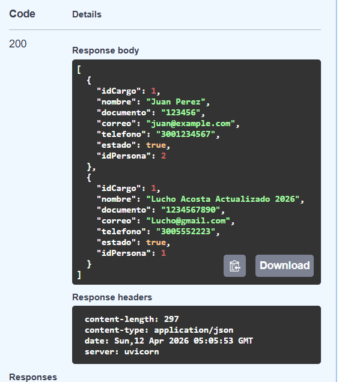
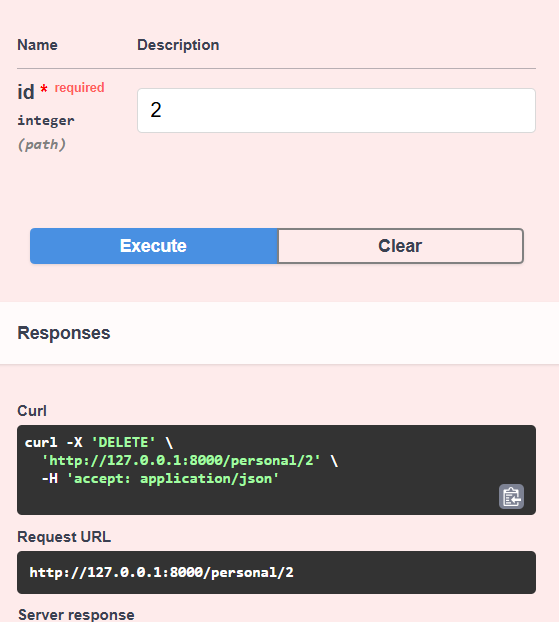
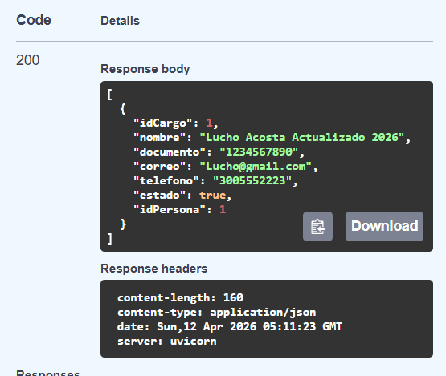

# Aplicaciones-y-servicios-web-2026-taller1
Repositorio para el segundo taller de Aplicaciones y servicios web 

# Taller 2

[Segundo taller](apps_services-Taller-2/Taller-2.pdf)

## Servicios con fastApi y conexion a base de datos PostgreSQL

En este taller se desarrolla un microservicio utilizando **FastAPI** conectado a una base de datos **PostgreSQL** real.

El sistema permite gestionar información de:

- Personal
- Formación académica

Implementando un **CRUD completo** para cada entidad, usando una arquitectura con:

- FastAPI (backend y endpoints)
- SQLAlchemy (ORM)
- Pydantic (validaciones)
- PostgreSQL (base de datos)

---

## 🧱 Arquitectura del proyecto

La estructura de carpetas del proyecto se organiza de la siguiente forma:

taller2/
│
├── main.py
├── db/
├── models/
├── schemas/
├── crud/
├── api/
├── .env
├── requirements.txt

Separando responsabilidades:

- `db/` → conexión a la base de datos  
- `models/` → modelos de SQLAlchemy  
- `schemas/` → validaciones con Pydantic  
- `crud/` → lógica de base de datos  
- `api/` → endpoints  

---

## ⚙️ Instalación

Seguir las instrucciones:

### Ubicarse en la carpeta del proyecto

```bash
cd ruta/del/proyecto
```

###  crear entorno virtual 

```bash
python -m venv venv
```

### Activar entorno virtual
```bash
source venv/bin/activate #Linux/macOs
venv\Scripts\activate   # Windows
```
### Instalar dependencias
```bash
pip install -r requirements.txt
```

## 🔐Configuracion archivo .env

Crear un archivo .env en la raíz del proyecto que contenga:

```env
DATABASE_URL=url de la base de datos a conectar
SCHEMA=schema dado por el profesor
```

## ▶️ Ejecución

Ejecutar el comando de uvicorn para levantar el servidor y actualizarlo automaticamente cada que se cambie el codigo.
```bash
uvicorn main:app --reload
```
Ir a la direccion en la cual esta corriendo el servidor con uvicorn
```bash
INFO:     Uvicorn running on http://127.0.0.1:X (X es el puerto por defecto de uvicorn, usualmente 8000)
http://127.0.0.1:8000
```

Despues de verificar que funciona, nos vamos a la url con la documentacion Swagger:

```bash
http://127.0.0.1:8000/docs
```



## 🔁 Endpoints disponibles

### Personal

```bash
POST    /personal/
GET     /personal/
GET     /personal/{id}
PUT     /personal/{id}
DELETE  /personal/{id}
```
### Formacion

```bash
POST    /formacion/
GET     /formacion/
GET     /formacion/{id}
PUT     /formacion/{id}
DELETE  /formacion/{id}
```

## 🧪 Testing

Crear registro (POST)

Ir al endpoint correspondiente (por ejemplo /personal/crear o /formacion/crear)
Presionar "Try it out" e ingresar un body válido:




Obtener registros (GET)

Ir al endpoint correspondiente (Por ejemplo /personal/ o /formacion/)
Presionar  "Try it out", presionar "Execute" y observar los resultados que se crearon con los endpoints anteriores (personal/crear y formacion/crear):




 > se ven dos registros creados y el codigo 200 (OK)

Actualizar registro (PUT)

Ir al endpoint correspondiente (/personal/{id}/actualizar o /formacion/{id}/actualizar)
Y digitar el id a quien se le actualizaran los datos, para poner un body con los datos actualizados del Personal, en este caso cambiando el nombre de "Lucho Acosta":



y vemos ahora en el endpoint de listamiento como quedo correctamente actualizado

}


Eliminar registro (DELETE)

Ir al endpoint correspondiente (/personal/{id}/eliminar o /formacion/{id}/eliminar)
Digitar el id de quien sera eliminado del sistema, iremos con Juan Perez para dejar a Lucho Acosta Actualizado 2026:



y verificamos en el endpoint de listamiento como quedo eliminado del sistema:



## ✅ Validaciones con Pydantic

El sistema implementa validaciones como:

- Tipos de datos correctos
- Campos obligatorios
- Validaciones personalizadas (fechas, valores, etc.)

AL tratar de ingresar un dato que incumpla con estas validaciones, mostrara el error 422 indicando que no reconoce los tipos de datos solicitados.